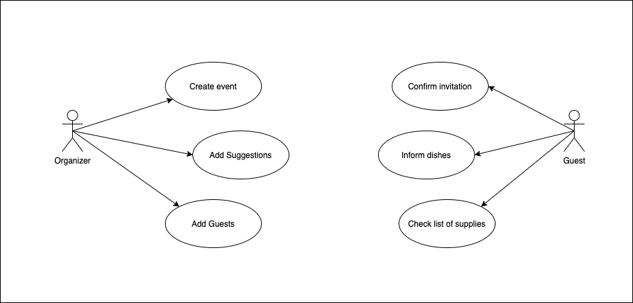
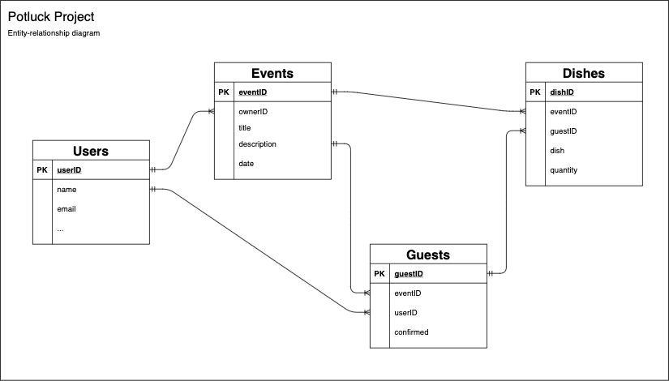

# Potluck Project
Project to test ZeroServer.js framework.
 
Webapp that proposes to manage what each guest will bring to a potluck event.

## Features
* Simple to use.
* Invite by email.
* Guests list.
* Dishes list.
* Suggested dishes/beverages/items by the organizer.
* Guests can add their own dishes.
* Organizer can choose if the page will show 'who' will bring 'what'.

## Problematic
Potluck events are fun and great time to met friends and family, try new recepies, revisit best dishes and enjoy the warm that food (and 🍷, 🍻, 🥂 😄) brings to our souls. However, the discussion about who-bring-what takes time, more and more scarce, and each personal decision can take time to think about.

## Objectives
Create an online tool where all guests can check how the event is being supplied and where they can communicate what they are planning to bring. 
In the future, features to engage the participation can be added.

## Libraries and Technologies used
* [ZeroServer.js](https://zeroserver.io/#getting-started) framework (that's the point here, right? )
* Typescript
* [Chakra-ui](https://chakra-ui.com/)

## Requirements
* NodeJS, v12.12.0 or higher
* Web browser
* MySQL database

## Setup and How to use the application
1. Download the repository files (project) or clone this project using the 'git clone' command.
2. Create database schema and tables.
3. Setup database connection on the file (...).
4. on the root folder run the command 'npx zero'.

## Documentation
### User Stories
[User Stories](https://docs.google.com/spreadsheets/d/e/2PACX-1vS3Liskuh8YOTSceREcBnoQsFvxEdR5JaUqq38aezApcaRxPJ_9Ml4rz5TYpOS_-T41Gp0tn1aHn6OR/pubhtml?gid=0&single=true)

### Use cases

### ERD - Entity Relationship Diagram
Diagram with the core entities 

## Design

